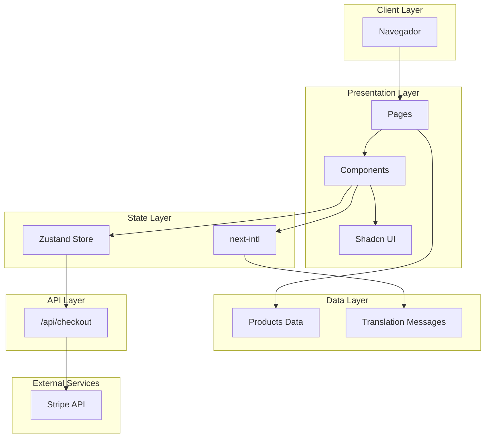
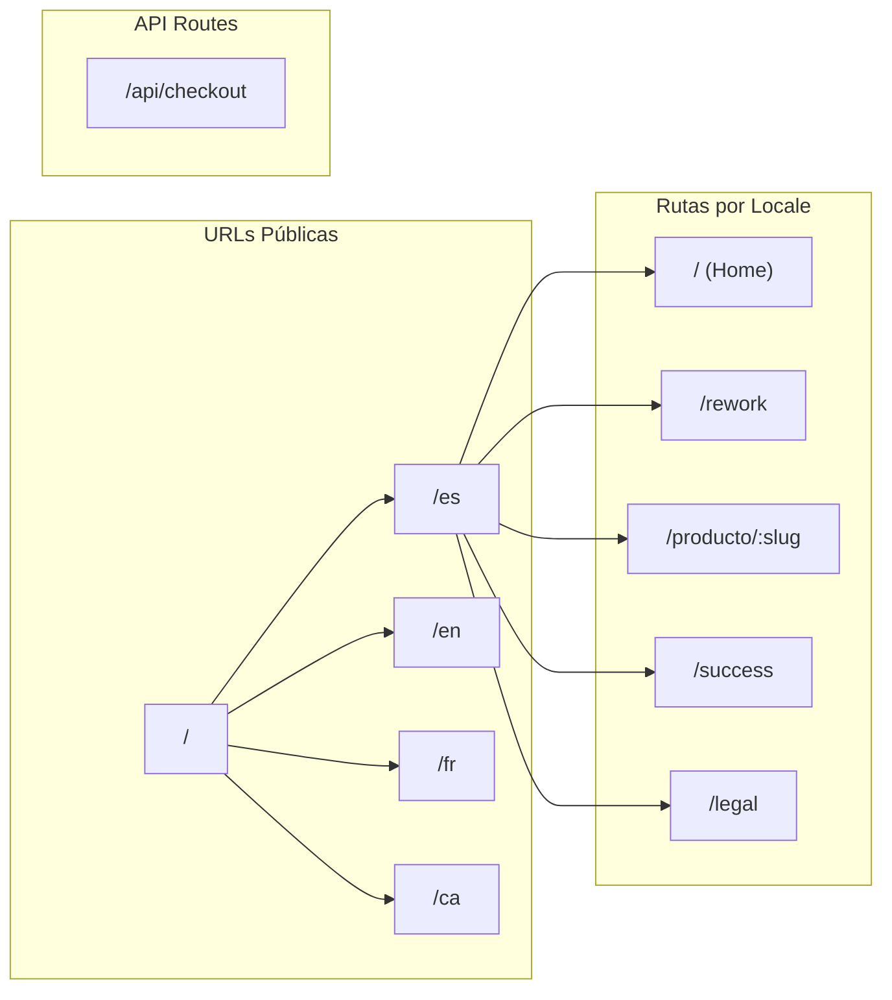
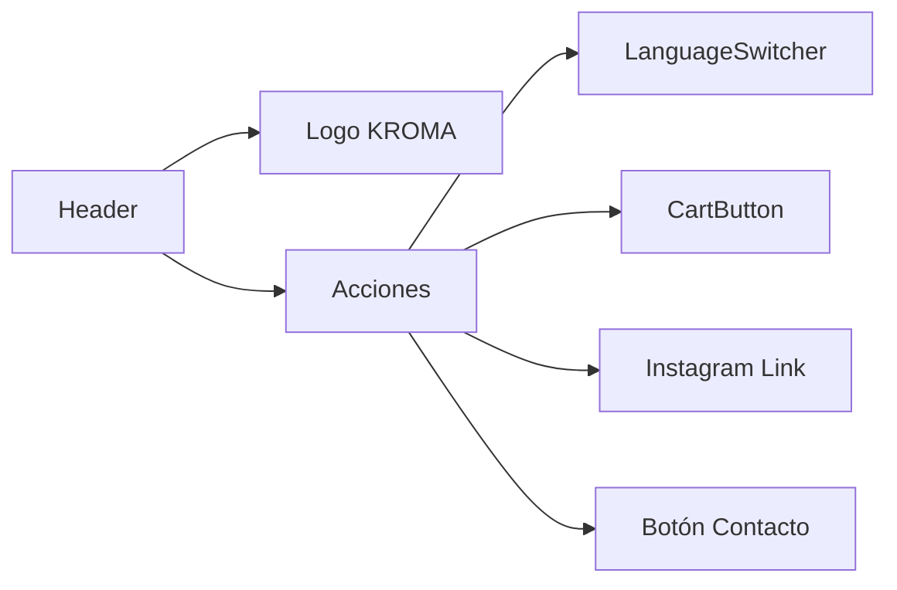
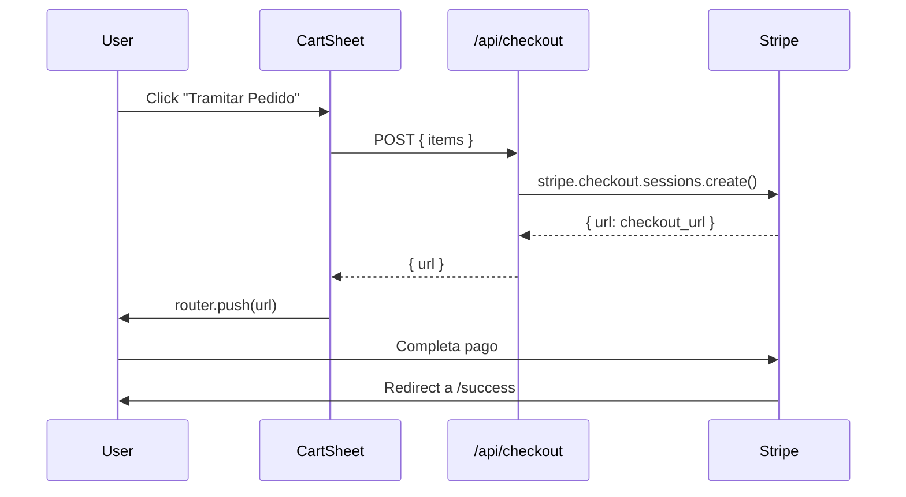

# KROMA Frontend - Documentación Técnica Exhaustiva

**Versión:** 0.1.0  
**Última actualización:** Enero 2026  
**Tipo de proyecto:** E-commerce de riñoneras artesanales  
**URL Local:** http://localhost:3001

---

## Índice
1. [Resumen del Proyecto](#resumen-del-proyecto)
2. [Stack Tecnológico](#stack-tecnológico)
3. [Arquitectura del Proyecto](#arquitectura-del-proyecto)
4. [Estructura de Archivos](#estructura-de-archivos)
5. [Configuraciones](#configuraciones)
6. [Sistema de Internacionalización (i18n)](#sistema-de-internacionalización-i18n)
7. [Sistema de Rutas](#sistema-de-rutas)
8. [Modelo de Datos](#modelo-de-datos)
9. [Gestión del Estado (Zustand)](#gestión-del-estado-zustand)
10. [Componentes del Sitio](#componentes-del-sitio)
11. [Componentes UI (Shadcn)](#componentes-ui-shadcn)
12. [API Routes](#api-routes)
13. [Sistema de Estilos](#sistema-de-estilos)
14. [Integración con Stripe](#integración-con-stripe)
15. [Páginas del Sitio](#páginas-del-sitio)
16. [Guía de Desarrollo](#guía-de-desarrollo)
17. [Guía de Despliegue](#guía-de-despliegue)

---

## Resumen del Proyecto

KROMA es una tienda online de **riñoneras artesanales** construida como landing page de alta conversión. El objetivo es que el usuario entre, se enamore del producto y compre en la menor cantidad de clics posible.

### Productos

| Producto | Slug | Precio | Dimensiones | Variantes |
|----------|------|--------|-------------|-----------|
| La Mini | `la-mini` | 20€ | 15×10×5 cm | Negro, Verde Oliva |
| La Todoterreno | `la-todoterreno` | 25€ | 20×14×6 cm | Azul Marino, Arena, Terracota |
| La Maxi | `la-maxi` | 30€ | 25×18×8 cm | Camuflaje, Negro Total |
| Rework V1 | `kroma-denim-vol-1` | 45€ | 22×15×6 cm | Denim Único |
| Rework V2 | `patchwork-ecleptico` | 50€ | 20×14×6 cm | Patchwork |

### Idiomas Soportados
- 🇪🇸 Español (default)
- 🇬🇧 English
- 🇫🇷 Français
- Català

---

## Stack Tecnológico

### Core Framework
| Tecnología | Versión | Descripción |
|------------|---------|-------------|
| **Next.js** | 16.1.3 | Framework React con App Router |
| **React** | 19.2.3 | Biblioteca UI |
| **TypeScript** | ^5 | Tipado estático |

### UI & Styling
| Tecnología | Versión | Descripción |
|------------|---------|-------------|
| **Tailwind CSS** | ^4 | Framework CSS utility-first |
| **Shadcn UI** | new-york | Componentes UI accesibles |
| **Lucide React** | ^0.562.0 | Iconos SVG |
| **tw-animate-css** | ^1.4.0 | Animaciones CSS |

### State & Data
| Tecnología | Versión | Descripción |
|------------|---------|-------------|
| **Zustand** | ^5.0.10 | Estado global con persistencia |
| **next-intl** | ^4.7.0 | Internacionalización |

### Payments
| Tecnología | Versión | Descripción |
|------------|---------|-------------|
| **Stripe** | ^20.2.0 | Procesador de pagos (server) |
| **@stripe/stripe-js** | ^8.6.1 | SDK cliente Stripe |

### Carruseles
| Tecnología | Versión | Descripción |
|------------|---------|-------------|
| **embla-carousel-react** | ^8.6.0 | Carrusel de imágenes |

---

## Arquitectura del Proyecto



---

## Estructura de Archivos

```
kroma_frontend/
├── .agent/workflows/         # Workflows automatizados
│   └── git-push.md
├── app/                      # Next.js App Router
│   ├── [locale]/             # Rutas localizadas
│   │   ├── layout.tsx        # Layout con Header/Footer
│   │   ├── page.tsx          # Home page
│   │   ├── producto/[slug]/  # Páginas de producto dinámicas
│   │   ├── success/          # Página post-compra
│   │   └── legal/            # Términos y condiciones
│   ├── api/checkout/         # API Stripe
│   │   └── route.ts
│   ├── globals.css           # Estilos globales y tema
│   ├── layout.tsx            # Root layout
│   └── favicon.ico
├── components/
│   ├── site/                 # Componentes específicos del sitio
│   │   ├── CartButton.tsx
│   │   ├── CartSheet.tsx
│   │   ├── Footer.tsx
│   │   ├── Header.tsx
│   │   ├── Hero.tsx
│   │   ├── LanguageSwitcher.tsx
│   │   ├── ProductCard.tsx
│   │   ├── ProductDetail.tsx
│   │   ├── ProductGallery.tsx
│   │   └── ValueProps.tsx
│   └── ui/                   # Componentes Shadcn UI
│       ├── accordion.tsx
│       ├── badge.tsx
│       ├── button.tsx
│       ├── card.tsx
│       ├── carousel.tsx
│       ├── dropdown-menu.tsx
│       ├── separator.tsx
│       └── sheet.tsx
├── i18n/                     # Configuración next-intl
│   ├── request.ts
│   └── routing.ts
├── lib/                      # Utilidades y datos
│   ├── products.ts           # Catálogo de productos
│   ├── store.ts              # Zustand cart store
│   └── utils.ts              # Función cn()
├── messages/                 # Traducciones
│   ├── ca.json
│   ├── en.json
│   ├── es.json
│   └── fr.json
├── public/                   # Assets estáticos
│   ├── IMG_6031.JPG          # Hero background
│   ├── kroma_lletres.png     # Logo principal
│   ├── logo_1*.png           # Variantes del logo
│   └── hero_lifestyle.png
├── components.json           # Configuración Shadcn
├── middleware.ts             # i18n middleware
├── next.config.ts            # Config Next.js
├── package.json
├── tailwind.config.ts        # (implícito en Tailwind v4)
└── tsconfig.json
```

---

## Configuraciones

### next.config.ts

```typescript
import type { NextConfig } from "next";
import createNextIntlPlugin from 'next-intl/plugin';

const withNextIntl = createNextIntlPlugin('./i18n/request.ts');

const nextConfig: NextConfig = {
  images: {
    remotePatterns: [
      {
        protocol: 'https',
        hostname: 'placehold.co',
      },
    ],
  },
};

export default withNextIntl(nextConfig);
```

> [!IMPORTANT]
> La integración de `next-intl` se realiza a través del plugin `createNextIntlPlugin` que envuelve la configuración de Next.js.

### tsconfig.json

```json
{
  "compilerOptions": {
    "target": "ES2017",
    "lib": ["dom", "dom.iterable", "esnext"],
    "strict": true,
    "module": "esnext",
    "moduleResolution": "bundler",
    "jsx": "react-jsx",
    "paths": {
      "@/*": ["./*"]
    }
  }
}
```

**Alias configurado:** `@/*` → raíz del proyecto

### components.json (Shadcn)

```json
{
  "style": "new-york",
  "rsc": true,
  "tsx": true,
  "tailwind": {
    "css": "app/globals.css",
    "baseColor": "neutral",
    "cssVariables": true
  },
  "iconLibrary": "lucide",
  "aliases": {
    "components": "@/components",
    "utils": "@/lib/utils",
    "ui": "@/components/ui"
  }
}
```

### package.json - Scripts

| Script | Comando | Descripción |
|--------|---------|-------------|
| `dev` | `next dev` | Servidor de desarrollo |
| `build` | `next build` | Build de producción |
| `start` | `next start` | Servidor de producción |
| `lint` | `eslint` | Análisis de código |

---

## Sistema de Internacionalización (i18n)

### Configuración de Rutas ([i18n/routing.ts](file:///Users/arnau/Documents/KROMA/kroma_frontend/i18n/routing.ts))

```typescript
import { defineRouting } from 'next-intl/routing';

export const routing = defineRouting({
    locales: ['ca', 'es', 'fr', 'en'],
    defaultLocale: 'es',
    localePrefix: 'always'  // Siempre muestra /es, /en, etc.
});
```

### Configuración de Request ([i18n/request.ts](file:///Users/arnau/Documents/KROMA/kroma_frontend/i18n/request.ts))

```typescript
import { getRequestConfig } from 'next-intl/server';
import { routing } from './routing';

export default getRequestConfig(async ({ requestLocale }) => {
    let locale = await requestLocale;

    if (!locale || !routing.locales.includes(locale as any)) {
        locale = routing.defaultLocale;
    }

    return {
        locale,
        messages: (await import(`../messages/${locale}.json`)).default
    };
});
```

### Middleware ([middleware.ts](file:///Users/arnau/Documents/KROMA/kroma_frontend/middleware.ts))

```typescript
import createMiddleware from 'next-intl/middleware';
import { routing } from './i18n/routing';

export default createMiddleware(routing);

export const config = {
    matcher: ['/', '/(ca|es|fr|en)/:path*']
};
```

### Estructura de Traducciones

Cada archivo de traducción (`messages/*.json`) contiene los siguientes namespaces:

| Namespace | Uso | Componente(s) |
|-----------|-----|---------------|
| `Header` | Navegación | Header.tsx |
| `Hero` | Sección hero | Hero.tsx |
| `Products` | Listado productos | page.tsx, ProductCard.tsx |
| `ValueProps` | Propuestas de valor | ValueProps.tsx |
| `ProductPage` | Página de producto | ProductDetail.tsx |
| `Cart` | Carrito | CartSheet.tsx |
| `Footer` | Pie de página | Footer.tsx |
| `Success` | Página de éxito | success/page.tsx |
| `Legal` | Términos legales | legal/page.tsx |
| `ProductData` | Datos de productos traducidos | ProductCard, ProductDetail |

### Ejemplo de uso en componentes

```tsx
"use client";
import { useTranslations, useLocale } from "next-intl";

export function MyComponent() {
    const t = useTranslations("Hero");
    const locale = useLocale();

    return <h1>{t("title")}</h1>; // "La riñonera definitiva."
}
```

---

## Sistema de Rutas

### Diagrama de Rutas



### Detalle de Rutas

| Ruta | Archivo | Tipo | Descripción |
|------|---------|------|-------------|
| `/[locale]` | `app/[locale]/page.tsx` | SSG | Página principal con Hero, Productos y ValueProps |
| `/[locale]/rework` | `app/[locale]/rework/page.tsx` | SSG | Catálogo de productos exclusivos (Rework) |
| `/[locale]/producto/[slug]` | `app/[locale]/producto/[slug]/page.tsx` | SSG | Página de detalle de producto |
| `/[locale]/success` | `app/[locale]/success/page.tsx` | Client | Confirmación post-compra |
| `/[locale]/legal` | `app/[locale]/legal/page.tsx` | Client | Términos y condiciones |
| `/api/checkout` | `app/api/checkout/route.ts` | API | Creación de sesión Stripe |

### Generación Estática

Las páginas de producto generan parámetros estáticos para todas las combinaciones locale × slug:

```typescript
export async function generateStaticParams() {
    const params: { locale: string; slug: string }[] = [];
    for (const locale of routing.locales) {
        for (const product of products) {
            params.push({ locale, slug: product.slug });
        }
    }
    return params;
}
```

**Total de páginas generadas:** 4 locales × 3 productos = 12 páginas de producto

---

## Modelo de Datos

### Interfaces ([lib/products.ts](file:///Users/arnau/Documents/KROMA/kroma_frontend/lib/products.ts))

```typescript
export interface Variant {
    id: string;          // Ej: "mini-black"
    name: string;        // Ej: "Negro"
    description?: string;
    image: string;       // URL de imagen específica
    priceId?: string;    // Stripe Price ID (price_...)
}

export interface Product {
    id: string;          // Ej: "mini"
    name: string;        // Ej: "La Mini"
    slug: string;        // Ej: "la-mini"
    price: number;       // Ej: 20
    description: string;
    features: string[];  // Array de 3 características
    dimensions: string;  // Ej: "15cm x 10cm x 5cm"
    materials: string;
    images: string[];    // Galería fallback
    variants: Variant[]; // Variantes de color
    category?: 'standard' | 'rework';
}
```

### Catálogo de Productos

```typescript
export const products: Product[] = [
    {
        id: "mini",
        name: "La Mini",
        slug: "la-mini",
        price: 20,
        description: "Perfecta para lo esencial...",
        features: ["Compacta y ligera", "Correa ajustable", "Cierre de seguridad"],
        dimensions: "15cm x 10cm x 5cm",
        materials: "Nylon impermeable de alta resistencia.",
        images: ["/placeholder-mini-1.jpg", "/placeholder-mini-2.jpg"],
        variants: [
            { id: "mini-black", name: "Negro", image: "/placeholder-mini-1.jpg", priceId: "replace_with_price_id" },
            { id: "mini-olive", name: "Verde Oliva", image: "/placeholder-mini-2.jpg", priceId: "replace_with_price_id" }
        ]
    },
    // ... todoterreno y maxi
];
```

> [!WARNING]
> Los `priceId` tienen valores placeholder (`replace_with_price_id_*`). Deben reemplazarse por IDs reales de Stripe en producción.

---

## Gestión del Estado (Zustand)

### Store del Carrito ([lib/store.ts](file:///Users/arnau/Documents/KROMA/kroma_frontend/lib/store.ts))

```typescript
import { create } from "zustand";
import { persist } from "zustand/middleware";

export interface CartItem {
    id: string;            // product.id + variant.id
    product: Product;
    variant: Variant;
    quantity: number;
}

interface CartState {
    items: CartItem[];
    addItem: (product: Product, variant: Variant) => void;
    removeItem: (itemId: string) => void;
    updateQuantity: (itemId: string, quantity: number) => void;
    clearCart: () => void;
    isOpen: boolean;
    setIsOpen: (isOpen: boolean) => void;
}
```

### Características del Store

| Característica | Implementación |
|----------------|----------------|
| **Persistencia** | `persist` middleware con localStorage |
| **Nombre en storage** | `kroma-cart` |
| **Datos persistidos** | Solo `items` (no `isOpen`) |
| **ID único de item** | `${product.id}-${variant.id}` |
| **Auto-open** | El carrito se abre tras añadir un producto |

### Uso en Componentes

```tsx
import { useCart } from "@/lib/store";

function MyComponent() {
    const { items, addItem, removeItem, updateQuantity, isOpen, setIsOpen } = useCart();
    
    const handleAdd = () => {
        addItem(product, selectedVariant);
    };
}
```

---

## Componentes del Sitio

### [Header.tsx](file:///Users/arnau/Documents/KROMA/kroma_frontend/components/site/Header.tsx)

**Ubicación:** `components/site/Header.tsx`  
**Tipo:** Client Component  
**Descripción:** Barra de navegación sticky con logo, selector de idioma, carrito e Instagram.



**Props:** Ninguna  
**Hooks usados:** `useLocale()`, `useTranslations("Header")`

**Características:**
- Sticky con backdrop blur
- Logo enlaza a `/${locale}`
- Botón contacto oculto en móvil (`hidden md:flex`)
- Instagram oculto en móvil pequeño (`hidden sm:block`)

---

### [Hero.tsx](file:///Users/arnau/Documents/KROMA/kroma_frontend/components/site/Hero.tsx)

**Ubicación:** `components/site/Hero.tsx`  
**Tipo:** Client Component  
**Descripción:** Sección hero fullscreen con imagen de fondo y CTA.

**Características:**
- Altura: `80vh`
- Imagen de fondo: `/IMG_6031.JPG` con `brightness(0.7)`
- Título con gradiente de tamaños responsive
- CTA con scroll suave a `#productos`

**Traducciones usadas:**
- `Hero.title` → "La riñonera definitiva."
- `Hero.subtitle` → "Tres tamaños, un estilo."
- `Hero.description`
- `Hero.cta` → "Ver Colección"

---

### [ProductCard.tsx](file:///Users/arnau/Documents/KROMA/kroma_frontend/components/site/ProductCard.tsx)

**Ubicación:** `components/site/ProductCard.tsx`  
**Tipo:** Client Component  
**Descripción:** Tarjeta de producto para el grid de la home.

**Props:**
```typescript
interface ProductCardProps {
    product: Product;
}
```

**Estructura:**
```
Card
├── CardHeader (imagen placeholder)
├── CardContent
│   ├── Nombre + Badge con precio
│   └── Descripción (line-clamp-2)
└── CardFooter (Botón "Ver Detalles")
```

**Navegación:** Enlaza a `/${locale}/producto/${product.slug}`

---

### [ProductDetail.tsx](file:///Users/arnau/Documents/KROMA/kroma_frontend/components/site/ProductDetail.tsx)

**Ubicación:** `components/site/ProductDetail.tsx`  
**Tipo:** Client Component  
**Descripción:** Componente completo de página de producto con selector de variantes.

**Props:**
```typescript
interface ProductDetailProps {
    product: Product;
}
```

**Layout:**
```
Grid 2 columnas (md)
├── Izquierda
│   ├── ProductGallery (carrusel)
│   └── Guía de tamaños (oculto en móvil)
└── Derecha
    ├── Badge "Hecho a mano"
    ├── Nombre (h1)
    ├── Precio
    ├── Descripción
    ├── Selector de variantes
    ├── Botón "Añadir al Carrito"
    ├── Accordion (Características, Medidas, Materiales)
    └── Guía de tamaños (solo móvil)
```

**State local:** `selectedVariant` (useState)

**Selector de variantes:**
- Botones pill con indicator de color
- Colores mapeados por ID de variante (`black`, `olive`, `navy`, etc.)

---

### [ProductGallery.tsx](file:///Users/arnau/Documents/KROMA/kroma_frontend/components/site/ProductGallery.tsx)

**Ubicación:** `components/site/ProductGallery.tsx`  
**Tipo:** Client Component  
**Descripción:** Carrusel de imágenes del producto.

**Props:**
```typescript
interface ProductGalleryProps {
    images: string[];
    productName: string;
}
```

**Usa:** Componente `Carousel` de Shadcn (Embla)

> [!NOTE]
> Actualmente muestra placeholders. Las imágenes reales deben ser añadidas en `/public/`.

---

### [CartButton.tsx](file:///Users/arnau/Documents/KROMA/kroma_frontend/components/site/CartButton.tsx)

**Ubicación:** `components/site/CartButton.tsx`  
**Tipo:** Client Component  
**Descripción:** Icono de carrito con badge contador.

**Características:**
- Icono `ShoppingBag` de Lucide
- Badge con cantidad total de items
- Animación `zoom-in` en el badge
- Protección de hidratación con `mounted` state

---

### [CartSheet.tsx](file:///Users/arnau/Documents/KROMA/kroma_frontend/components/site/CartSheet.tsx)

**Ubicación:** `components/site/CartSheet.tsx`  
**Tipo:** Client Component  
**Descripción:** Panel lateral del carrito con lista de items y checkout.

**Funcionalidades:**
- Lista de items con imagen, nombre, variante
- Controles de cantidad (+/-)
- Botón eliminar item
- Total calculado
- Botón checkout (llama a `/api/checkout`)
- Estado de carga durante checkout
- Estado vacío con CTA

**Flujo de checkout:**
```typescript
const handleCheckout = async () => {
    const response = await fetch("/api/checkout", {
        method: "POST",
        body: JSON.stringify({ items }),
    });
    const data = await response.json();
    if (data.url) router.push(data.url);
};
```

---

### [LanguageSwitcher.tsx](file:///Users/arnau/Documents/KROMA/kroma_frontend/components/site/LanguageSwitcher.tsx)

**Ubicación:** `components/site/LanguageSwitcher.tsx`  
**Tipo:** Client Component  
**Descripción:** Dropdown selector de idioma.

**Idiomas disponibles:**
```typescript
const locales = [
    { code: "ca", label: "Català" },
    { code: "es", label: "Español" },
    { code: "fr", label: "Français" },
    { code: "en", label: "English" },
];
```

**Comportamiento:** Reemplaza el segmento de locale en la URL actual y navega usando `router.replace()`.

---

### [ValueProps.tsx](file:///Users/arnau/Documents/KROMA/kroma_frontend/components/site/ValueProps.tsx)

**Ubicación:** `components/site/ValueProps.tsx`  
**Tipo:** Client Component  
**Descripción:** Grid de 3 propuestas de valor.

**Props mostradas:**
| Icono | Clave | Título (ES) |
|-------|-------|-------------|
| `HandMetal` | `handmade` | Hecho a Mano |
| `Droplets` | `waterproof` | Tela Impermeable |
| `Truck` | `shipping` | Envío Rápido |

---

### [Footer.tsx](file:///Users/arnau/Documents/KROMA/kroma_frontend/components/site/Footer.tsx)

**Ubicación:** `components/site/Footer.tsx`  
**Tipo:** Client Component  
**Descripción:** Pie de página con copyright, legal e Instagram.

**Contenido:**
- Copyright dinámico con año actual
- Link a `/${locale}/legal`
- Icono de Instagram

---

## Componentes UI (Shadcn)

Todos ubicados en `components/ui/`. Estilo: **new-york**.

| Componente | Archivo | Descripción |
|------------|---------|-------------|
| **Accordion** | `accordion.tsx` | Secciones colapsables (especificaciones) |
| **Badge** | `badge.tsx` | Etiquetas (precio, "Hecho a mano") |
| **Button** | `button.tsx` | Botones con variantes (default, outline, ghost, etc.) |
| **Card** | `card.tsx` | Tarjetas de producto |
| **Carousel** | `carousel.tsx` | Galería de imágenes (Embla) |
| **DropdownMenu** | `dropdown-menu.tsx` | Selector de idioma |
| **Separator** | `separator.tsx` | Líneas divisorias |
| **Sheet** | `sheet.tsx` | Panel lateral (carrito) |

### Button Variants

```typescript
const buttonVariants = cva("...", {
    variants: {
        variant: {
            default: "bg-primary text-primary-foreground hover:bg-primary/90",
            destructive: "...",
            outline: "border bg-background shadow-xs hover:bg-accent",
            secondary: "bg-secondary text-secondary-foreground",
            ghost: "hover:bg-accent hover:text-accent-foreground",
            link: "text-primary underline-offset-4 hover:underline",
        },
        size: {
            default: "h-9 px-4 py-2",
            sm: "h-8 rounded-md gap-1.5 px-3",
            lg: "h-10 rounded-md px-6",
            icon: "size-9",
        },
    },
});
```

---

## API Routes

### POST /api/checkout ([route.ts](file:///Users/arnau/Documents/KROMA/kroma_frontend/app/api/checkout/route.ts))

**Descripción:** Crea una sesión de Stripe Checkout.

**Request Body:**
```typescript
{
    items: CartItem[]
}
```

**Response:**
```typescript
{
    url: string  // URL de Stripe Checkout
}
```

**Configuración de Stripe:**

| Campo | Valor |
|-------|-------|
| `mode` | `payment` |
| `shipping_address_collection` | Solo España (`ES`) |
| `shipping_options` | Envío Estándar gratuito (2-4 días) |
| `success_url` | `${origin}/success` |
| `cancel_url` | `${origin}/` |

**Lógica de line items:**
```typescript
if (item.variant.priceId?.startsWith("price_")) {
    // Usa Price ID de Stripe existente
    return { price: item.variant.priceId, quantity };
} else {
    // Crea precio ad-hoc (para testing)
    return {
        price_data: {
            currency: "eur",
            product_data: { name, description, images },
            unit_amount: price * 100,  // céntimos
        },
        quantity,
    };
}
```

> [!CAUTION]
> La variable de entorno `STRIPE_SECRET_KEY` debe estar configurada. Actualmente usa `dummy_key_for_build` como fallback.

---

## Sistema de Estilos

### Tema de Colores ([globals.css](file:///Users/arnau/Documents/KROMA/kroma_frontend/app/globals.css))

#### Light Mode (`:root`)
```css
--background: hsl(0 0% 100%);        /* Blanco */
--foreground: hsl(240 10% 3.9%);     /* Casi negro */
--primary: hsl(285 36% 42%);         /* Púrpura (brand) */
--secondary: hsl(240 4.8% 95.9%);    /* Gris claro */
--accent: hsl(144 38% 55%);          /* Verde */
--muted: hsl(240 4.8% 95.9%);
--destructive: hsl(0 84.2% 60.2%);   /* Rojo */
--border: hsl(240 5.9% 90%);
--ring: hsl(285 36% 42%);            /* Púrpura (focus) */
```

#### Sistema de Radios
```css
--radius: 0.625rem;                   /* Base */
--radius-sm: calc(var(--radius) - 4px);
--radius-md: calc(var(--radius) - 2px);
--radius-lg: var(--radius);
--radius-xl: calc(var(--radius) + 4px);
```

### Tipografía

**Fuente principal:** Outfit (Google Fonts)

```typescript
const outfit = Outfit({
    subsets: ["latin"],
    variable: "--font-outfit",
    display: "swap",
});
```

### Clases Utilitarias

| Clase | Uso |
|-------|-----|
| `scroll-smooth` | Scroll suave en `<html>` |
| `antialiased` | Suavizado de fuentes |
| `bg-background` | Fondo del tema |
| `text-foreground` | Color de texto del tema |

---

## Integración con Stripe

### Variables de Entorno Requeridas

| Variable | Descripción |
|----------|-------------|
| `STRIPE_SECRET_KEY` | Clave secreta de Stripe (sk_...) |
| `STRIPE_SHIPPING_RATE_ID` | (Opcional) ID de rate de envío |

### Flujo de Pago



### Configuración de Envío

```typescript
shipping_options: [{
    shipping_rate_data: {
        type: 'fixed_amount',
        fixed_amount: { amount: 0, currency: 'eur' },
        display_name: 'Envío Estándar',
        delivery_estimate: {
            minimum: { unit: 'business_day', value: 2 },
            maximum: { unit: 'business_day', value: 4 },
        },
    },
}],
```

---

## Páginas del Sitio

### Home (`/[locale]`)

**Secciones:**
1. **Hero** - Imagen fullscreen con CTA
2. **Productos** - Grid 3 columnas con ProductCard
3. **ValueProps** - 3 propuestas de valor

**Componentes usados:** `Hero`, `ProductCard`, `ValueProps`

---

### Producto (`/[locale]/producto/[slug]`)

**Componentes usados:** `ProductDetail`, `ProductGallery`

**SEO:** Generación estática para todas las combinaciones locale × slug.

---

### Success (`/[locale]/success`)

**Descripción:** Página de confirmación post-compra.

**Elementos:**
- Icono checkmark animado
- Título "¡Gracias por tu pedido!"
- Descripción sobre email de confirmación
- Botón "Volver al Inicio"

---

### Legal (`/[locale]/legal`)

**Secciones:**
1. Introducción
2. Envíos y Devoluciones
3. Garantía
4. Privacidad

---

## Guía de Desarrollo

### Instalación

```bash
# Clonar e instalar
git clone <repo>
cd kroma_frontend
npm install

# Desarrollo
npm run dev
```

### Añadir un Nuevo Producto

1. **Editar `lib/products.ts`:**
```typescript
{
    id: "new-product",
    name: "El Nuevo",
    slug: "el-nuevo",
    price: 35,
    description: "...",
    features: ["...", "...", "..."],
    dimensions: "...",
    materials: "...",
    images: ["/new-1.jpg", "/new-2.jpg"],
    variants: [
        { id: "new-red", name: "Rojo", image: "/new-red.jpg" }
    ]
}
```

2. **Añadir traducciones en `messages/*.json`:**
```json
"ProductData": {
    "el-nuevo": {
        "name": "El Nuevo",
        "description": "...",
        "features": ["...", "...", "..."],
        "materials": "..."
    },
    "variants": {
        "new-red": "Rojo"
    }
}
```

3. **Añadir imágenes en `/public/`**

### Añadir un Nuevo Idioma

1. **Editar `i18n/routing.ts`:**
```typescript
locales: ['ca', 'es', 'fr', 'en', 'de'],  // Añadir 'de'
```

2. **Crear `messages/de.json`** copiando estructura de `es.json`

3. **Actualizar `LanguageSwitcher.tsx`:**
```typescript
const locales = [
    // ...existing,
    { code: "de", label: "Deutsch" },
];
```

4. **Actualizar `middleware.ts`:**
```typescript
matcher: ['/', '/(ca|es|fr|en|de)/:path*']
```

### Añadir un Nuevo Componente Shadcn

```bash
npx shadcn@latest add <component-name>
```

---

## Guía de Despliegue

### Variables de Entorno de Producción

```env
STRIPE_SECRET_KEY=sk_live_...
NEXT_PUBLIC_SITE_URL=https://kroma.com
```

### Build de Producción

```bash
npm run build
npm run start
```

### Despliegue en Vercel

1. Conectar repositorio a Vercel
2. Configurar variables de entorno
3. Deploy automático en push a main

### Checklist Pre-Producción

- [ ] Reemplazar `priceId` placeholders en `lib/products.ts`
- [ ] Configurar `STRIPE_SECRET_KEY` real
- [ ] Añadir imágenes reales de productos
- [ ] Configurar branding en Stripe Dashboard
- [ ] Revisar textos legales
- [ ] Configurar dominio personalizado
- [ ] Activar HTTPS
- [ ] Configurar Google Analytics (opcional)

---

## Diagrama de Arquitectura Completo

```mermaid
graph TB
    subgraph "Frontend (Next.js 16)"
        subgraph "App Router"
            RootLayout[Root Layout]
            LocaleLayout[Locale Layout]
            HomePage[Home Page]
            ProductPage[Product Page]
            SuccessPage[Success Page]
            LegalPage[Legal Page]
        end

        subgraph "Components"
            Header
            Footer
            Hero
            ProductCard
            ProductDetail
            ProductGallery
            CartSheet
            CartButton
            LanguageSwitcher
            ValueProps
        end

        subgraph "Shadcn UI"
            Button
            Card
            Carousel
            Accordion
            Sheet
            DropdownMenu
            Badge
        end

        subgraph "State"
            ZustandStore[Zustand Cart Store]
            NextIntl[next-intl Provider]
        end
    end

    subgraph "Data"
        Products[products.ts]
        Messages[messages/*.json]
    end

    subgraph "API"
        CheckoutAPI[/api/checkout]
    end

    subgraph "External"
        StripeAPI[Stripe API]
        StripeCheckout[Stripe Checkout]
    end

    RootLayout --> LocaleLayout
    LocaleLayout --> Header
    LocaleLayout --> Footer
    LocaleLayout --> HomePage
    LocaleLayout --> ProductPage
    LocaleLayout --> SuccessPage
    LocaleLayout --> LegalPage

    Header --> CartButton
    Header --> LanguageSwitcher
    HomePage --> Hero
    HomePage --> ProductCard
    HomePage --> ValueProps
    ProductPage --> ProductDetail
    ProductDetail --> ProductGallery

    CartButton --> ZustandStore
    CartSheet --> ZustandStore
    ProductDetail --> ZustandStore
    CartSheet --> CheckoutAPI
    CheckoutAPI --> StripeAPI
    StripeAPI --> StripeCheckout

    NextIntl --> Messages
    ProductCard --> Products
    ProductDetail --> Products
```

---

> [!TIP]
> Esta documentación sirve como referencia completa para cualquier desarrollador que trabaje en KROMA. Mantenla actualizada tras cambios significativos en la arquitectura.
